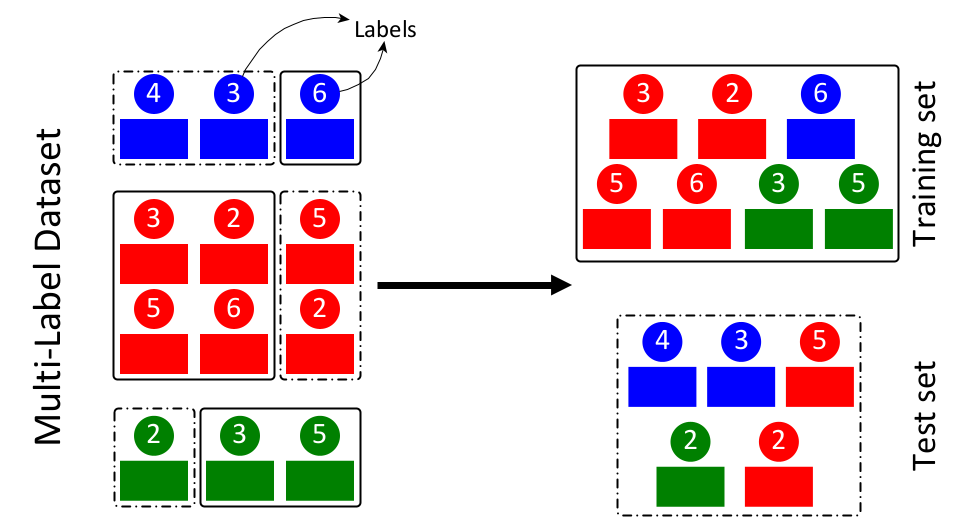

## Basic Description

This repo contains an implementation of straSplit comprising 8 algorithms to split multi-label data into two sets: training and test.

## Dependencies

The codebase is tested to work under Python 3.8. To install the necessary requirements, run the following commands:

``pip install -r requirements.txt``

Basically, *straSplit* requires following packages:

- [Anaconda](https://www.anaconda.com)
- [NumPy](http://www.numpy.org) (>= 1.18)
- [scikit-learn](https://scikit-learn.org/stable) (>= 0.24)
- [pandas](http://pandas.pydata.org) (>= 1.2)
- [NetworkX](https://networkx.github.io/) (== 2.5)
- [scipy](https://www.scipy.org/index.html) (>=1.6)
- [altair](https://altair-viz.github.io/) (==4.1)

## Installation and Basic Usage

Run the following commands to clone the repository to an appropriate location:

``git clone https://github.com/arbasher/straSplit``

Please follow this [notebook](src/doc/split.ipynb) for tutorials.

## Citing

If you find *straSplit* useful in your research, please consider citing the following papers:

- M. A. Basher, Abdur Rahman, McLaughlin, Ryan J., and Hallam, Steven
  J.. **["Metabolic pathway inference using multi-label classification with rich pathway features."](https://doi.org/10.1371/journal.pcbi.1008174)**
  , PLoS Comput Biol (2020).
- M. A. Basher, Abdur Rahman and Hallam, Steven
  J.. **["Multi-label pathway prediction based on active dataset subsampling."](https://www.biorxiv.org/content/10.1101/2020.09.14.297424v1)**
  , bioRxiv (2020).
- M. A. Basher, Abdur
  Rahman. **["Machine learning methods for metabolic pathway inference from genomic sequence information."](https://open.library.ubc.ca/cIRcle/collections/ubctheses/24/items/1.0394748)**
  , Doctoral dissertation, University of British Columbia, (2020).
- Moyano, J.M., Gibaja, E.L. and Ventura,
  S.. **["MLDA: A tool for analyzing multi-label datasets."](https://www.sciencedirect.com/science/article/abs/pii/S0950705117300308)**
  , Knowledge-Based Systems (2017).
- Merrillees, M. and Du, L.. **["Stratified sampling for extreme multi-label data."](https://arxiv.org/abs/2103.03494)**
  , arXiv preprint (2021).
- Sechidis, K., Tsoumakas, G. and Vlahavas,
  I.. **["On the stratification of multi-label data."](https://link.springer.com/chapter/10.1007/978-3-642-23808-6_10)**
  , In Joint European Conference on Machine Learning and Knowledge Discovery in Databases (pp. 145-158). Springer,
  Berlin, Heidelberg (2011).

## Contact

For any inquiries, please contact: [arbasher@student.ubc.ca](mailto:arbasher@student.ubc.ca)